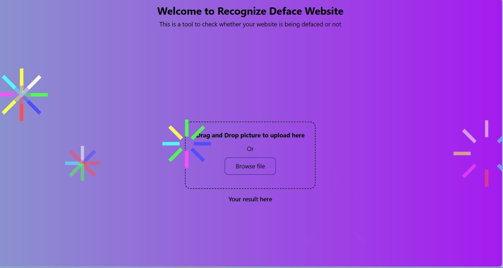
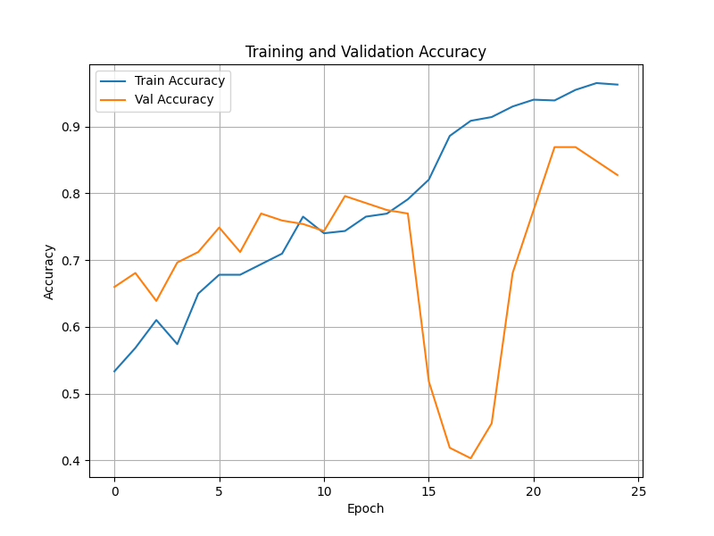
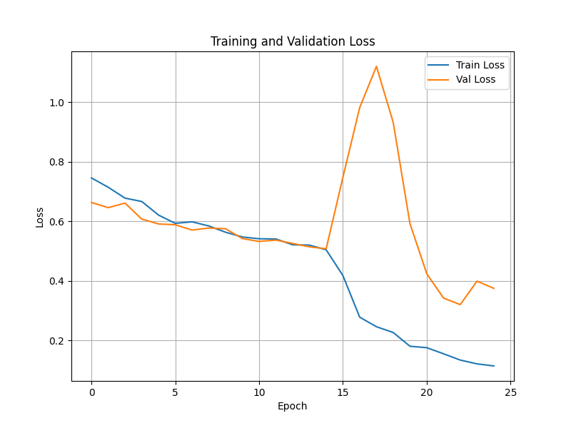
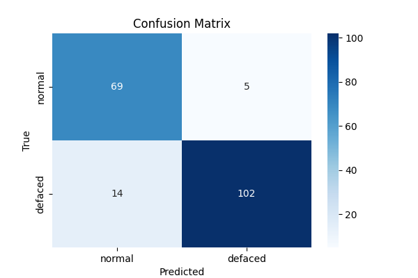

# Wellcome to my regconize deface webiste 🌸🌸
This is where your web will be check to see whether it is **defaced** or not.
By simply upload your photo to my website and see the result

------------------------------------------------------------------
## Using HTML, CSS and JavaScript 🌠
It is still a basic static website but it has all the needs such as upload your photo, give the result using fastAPI and a touch of animation things go around for pretty 😯

## Model 🐋
I am using the Tensorflow model to training all the dataset which I collect from [ZoneH.org](https://www.zone-h.org/) - where you can find a lot of website are being defaced and collect image from those.
Here is the result of training:

## Demo 📚
Check this link for [Demo](https://drive.google.com/file/d/1pgulZpJ2nHB4fPGrWt6pDHBnwNbHlev3/view?usp=sharing)
